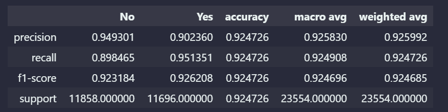
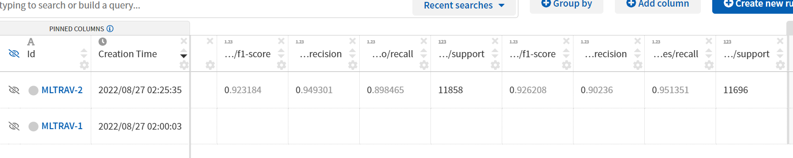

# ml-travel-insurance

Fun project to model propensity to claim as a classifcation problem, and serve as a template for a more robust personal ML development framework, and of course to try out new cool tools.

- docker workspaces in vscode
- neptune.ai
- buildkite

Data is originally from [Kaggle](https://www.kaggle.com/datasets/mhdzahier/travel-insurance). While the features are simple and the claims response is pretty straightforward, strangely many enthusiasts seem to use sales premium and commission dollars as a feature to predict claim lodgement.

While it is understood that this is a contrived example, it leads to a somewhat unrealistic and circular logic, given the commissions are based on premiums which are in turned based on the risk of a particular profile. So, using premiums to predict claims which are then used again to predict premiums isn't a very reliable strategy in the real world.

## **Table of Contents**
- [ML architecture](ml-architecture)
- [Data quality](data-quality)
- [Data analysis](data-analysis)
- [Model results](model-results)
- [Local developlemt](local-development)
- [Folder structure](folder-structure)
- [To do](to-do)

## **ML architecture**

Local development architecture abstracts whole pipeline into 3 main pipeline components. Currently uses `github actions` for CI (including testing and linting), and trying out [neptune.ai](https://app.neptune.ai/) for experiment tracking. To try and implement buildkite personally for CD.

(<a href="#top">back to top</a>)

## **Data quality**

Data preprocessing required for some of the erronous entries. Note that professional judgement was required for some of the decisions below.

- removing non positive premiums
- remove ages > 100
- remove duration > 547
- removed gender as a feature due to significant prportion of missing values
- ~8% of data points removed from cleaning

(<a href="#top">back to top</a>)

## **Data analysis**
- 58525 data points after cleaning, 914 claim and ~1.5% claim frequency
- severly imbalanced dataset requies over/under sampling techniques. SMOTE used here
- Age seems to have a slight downward effect on claim frequency
- Strange peak of exposure at 36 years

- duration has a few unrealistic values upwards of 10 years, these have been removed and capped at 547 given the drop off in exposure for anything past
- duration 365 has a claims high frequency compared to non-annual policies
- destination has high cardinality ~top 20 countries capture ~90% of all data points and claims

(<a href="#top">back to top</a>)

## **Model results**

Model was expectedly predicting all 'No' without any over/under sampling implemented. This resulted in a higher raw accuracy but 0 precision, with a weighted accuracy of ~50%

(<a href="#top">back to top</a>)

## **Local development**

- `git clone https://github.com/jtsw1990/ml-travel-insurance.git`
- `pip install -r requirements.txt` after setting up your environment or docker workspace

(<a href="#top">back to top</a>)

## **Folder structure**

- `assets` contains images and other documentation related visuals
- `data` contains the original `.csv` data file
- `interactive` contains `jupyter notebooks` used for data analyses and charting
- `models` contains outputs from training runs with prefix `YYYYMMDDHMS` corresponding to the neptune experiement ID
- `src` contains the main pipeline scripts
    - `src/modules` contains utility functions
    - `src/tests` contains unit tests

(<a href="#top">back to top</a>)

## **To do**

- explore and implement data quality tracking in neptune.ai
- integrate buildkite pipeline for CD

(<a href="#top">back to top</a>)

