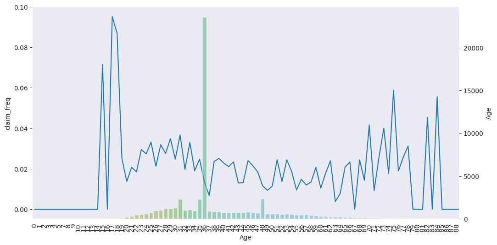
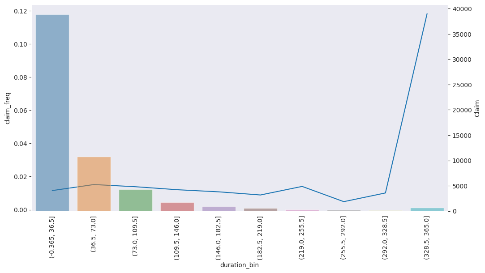

# ml-travel-insurance
fun e2e machine learning project to modeling propensity to claim

## Preprocessing
- removing non positive premiums
- remove ages > 100
- remove duration > 547

## Exploratory data analysis
- 58525 data points after cleaning, 914 claim and ~1.5% claim frequency
- highly imbalanced dataset

- Age seems to have a slight downward effect on claim frequency
- Strange peak of exposure at 36 years

- duration has a few unrealistic values upwards of 10 years, to either delete or bin  those
- duration 365 has a high frequency compared to non-annual policies

- destination has high cardinality ~top 20 countries capture ~90% of all data points and claims

## Feature engineering
- one hot encoding for categorical
